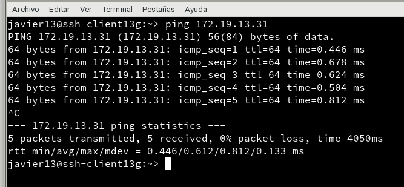
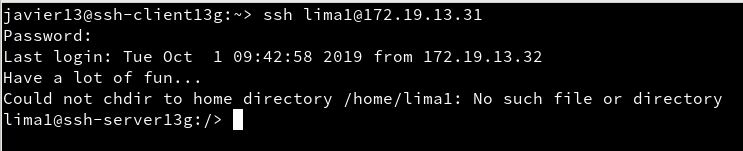

# Actividad Acceso remoto SSH
La actividad consta de hacer acceso remoto por SSH, con una máquina como servidor (OpenSUSE)
y dos máquinas clientes, otro OpenSUSE y un Windows 7.
## 2.2 Primera conexión SSH GNU/Linux

## 3.2 Comprobar cambio clave servidor SSH

## 5 Autenticación mediante clave pública

## 6 Uso de SSH como túnel para X

## 8.1 Restricción sobre un usuario

