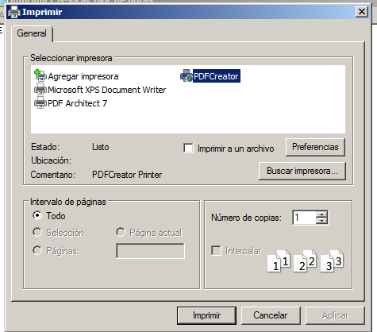
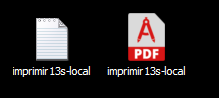
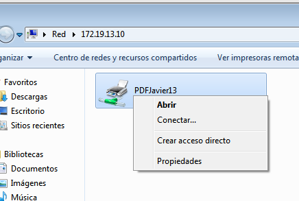
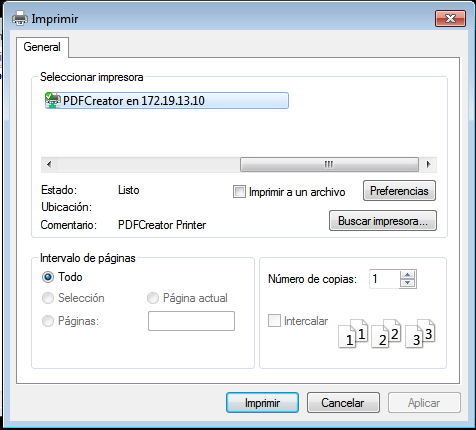
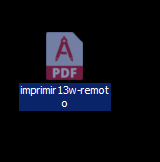
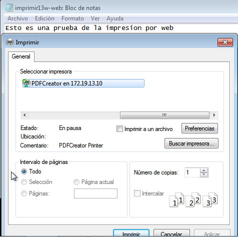
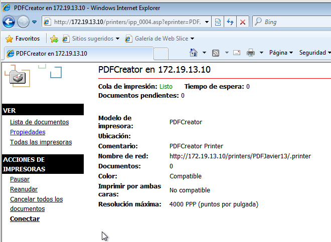
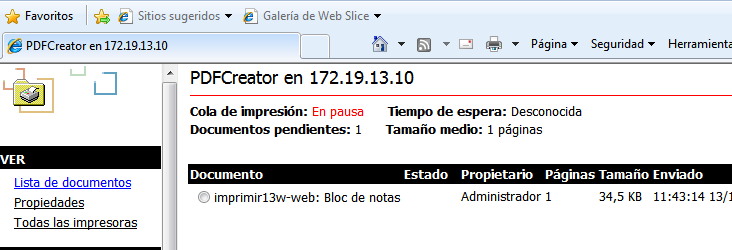
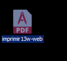

# Servidor impresión Windows
## 1. Impresora compartida
### 1.3 Probar la impresora en local
Creamos un fichero con el nombre: ```imprimirXXs-local```, para imprimirlo desde la
impresora en local.
Al darle a imprimir seleccionamos ```PDFCreator``` y le damos a imprimir.


Vemos como se nos ha creado el fichero PDF.



## 2. Compartir por red
### 2.2 Comprobar desde el cliente
Creamos un segundo fichero, llamado ```imprimirXXw-remoto```, en el cliente y lo
imprimimos por red.
Nos conectamos mediante la IP de la impresora.



Seleccionamos la PDFCreator y le damos a imprimir.



Y comprobamos que se nos creó el fichero PDF.



## 3. Acceso Web
### Comprobar desde el navegador
Por último, imprimiremos desde la web un fichero llamado ```imprimirXXw-web```.


Abrimos un navegador y ponemos la IP de la impresora en la URL. Y nos sale la siguiente imagen.


Pausamos la impresora para comprobar que se nos queda la impresión en la cola de la impresora.


Comprobamos que se nos creó el fichero PDF.


