# Salt-stack con OpenSUSE

## 1. Preparativos
Config |  MV1    |  MV2
---    |  ---    | ---
Alias  |  Master | Minion
Hostname | masterXXg | minion13g
So |  OpenSUSE  | OpenSUSE
IP |172.19.XX.31 | 172.19.XX.32

## 2. Master: instalar y configurar
º Vamos a la MV1 e instalamos el ``salt-master``

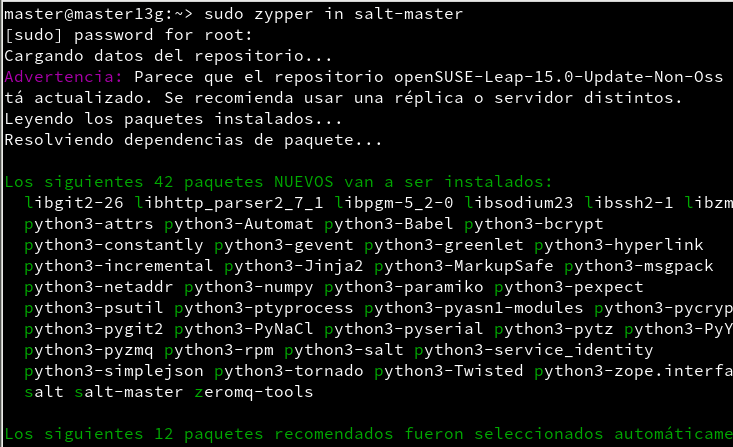

º Modificamos el fichero ``/etc/salt/master``.

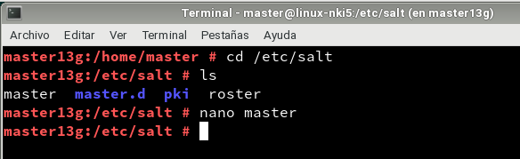

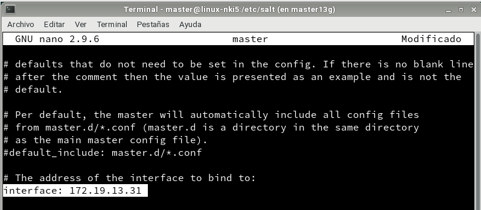

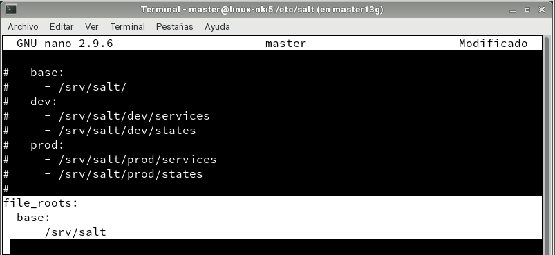

º Activamos el arranque del sistema e iniciamos el servicio.
Para poder ver si hay minions pendientes de aceptación o ya están aceptados, usamos: ``salt-key -L``.

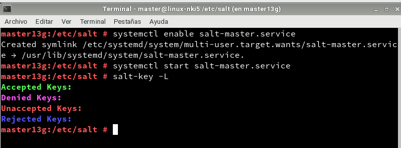

## 3. Minion

### 3.1 Instalación y configuración
º Instalamos el software ``salt-minion`` en la MV2.

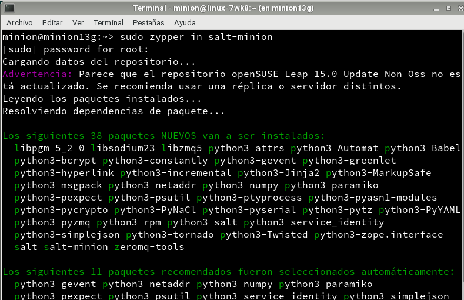

º Modificamos el fichero ``/etc/salt/minion`` agregando la máquina master.

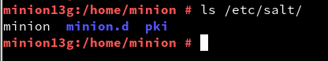
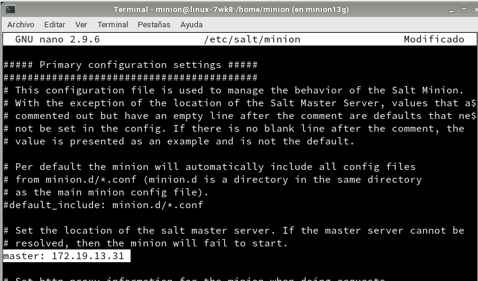

º Activamos el arranque del sistema e iniciamos el servicio.

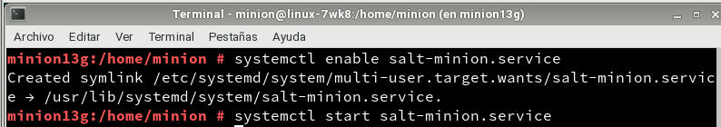

º Comprobamos que apache2 no esta instalado.

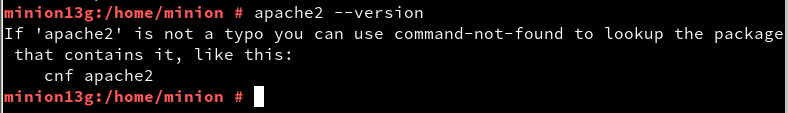

### 3.2 Desactivar el Firewall
º Vamos a la máquina master.
º Tenemos que asegurarnos de que el cortafuegos nos permite la conexión al servicio Salt.

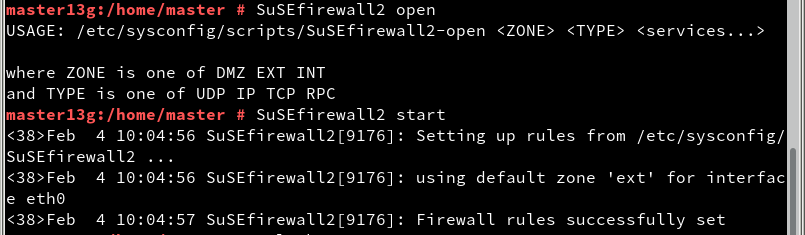

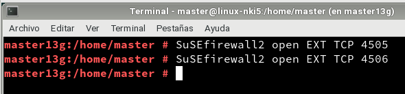

### 3.3 Aceptación desde el master
º Vamos a la máquina master y comprobamos que el minion está pendiente de aceptación.
º Para aceptarlo hacemos el siguiente comando: ``salt-key -a minion13g``.
º Volvemos a comprobar si ha sido aceptado.

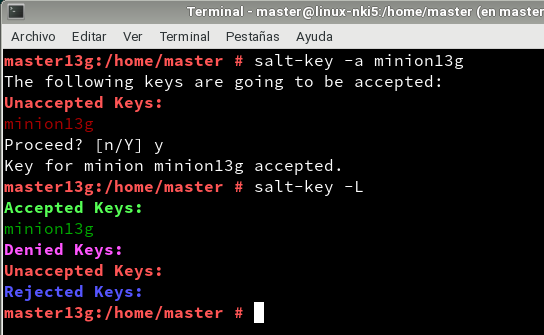

### 3.4 Comprobamos conectividad
Comprobamos la conectividad esde el Máster a los Minions.

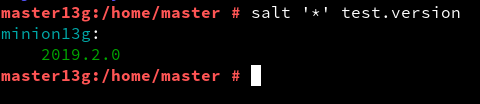

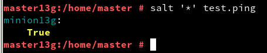

## 4 Salt States

### 4.1 Preparar el directorio para los estados
Ahora crearemos directorios para guardar los estados de Salt.
º Creamos los dos siguientes directorios:
``/srv/salt/base`` y ``/srv/salt/devel``.

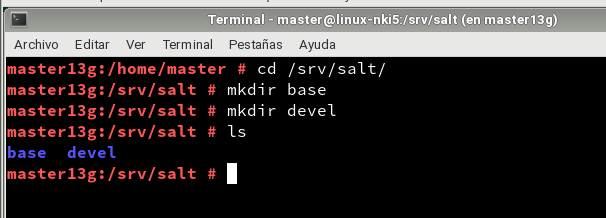

º Creamos el archivo ``/etc/salt/master.d/roots.conf`` con el siguiente contenido:

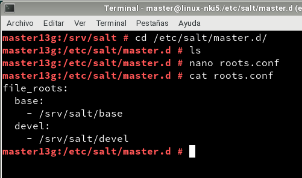

º Reiniciamos el servicio del Master.

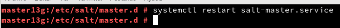

### 4.2 Crear un nuevo estado
º Crear el fichero ``/srv/salt/base/apache/init.sls`` con el siguiente código.

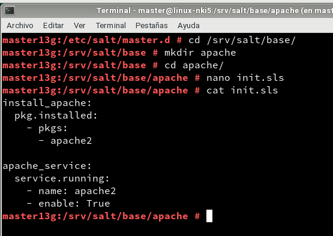

### 4.3 Asociar Minions a estados
º Vamos al Master.
º Creamos el fichero ``/srv/salt/base/top.sls`` donde vamos a asociar todos los minions.

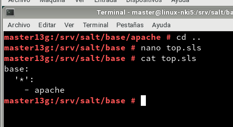

### 4.4 Comprobar: estados definidos
º Comprobamos los estados definidos.

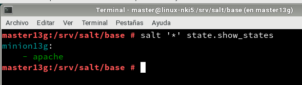

### 4.5 Aplicar el nuevo estados
º En el master consultamos los estados con detalles y verificar que no hay errores en las definiciones.

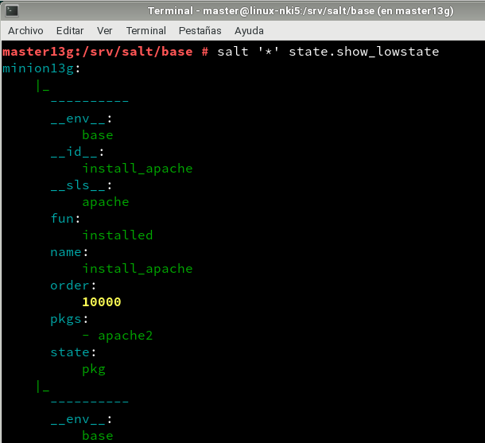
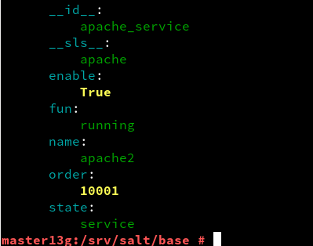

º Para aplicar el nuevo estado en todos los minions usamos el siguiente comando que se ve en la imagen.

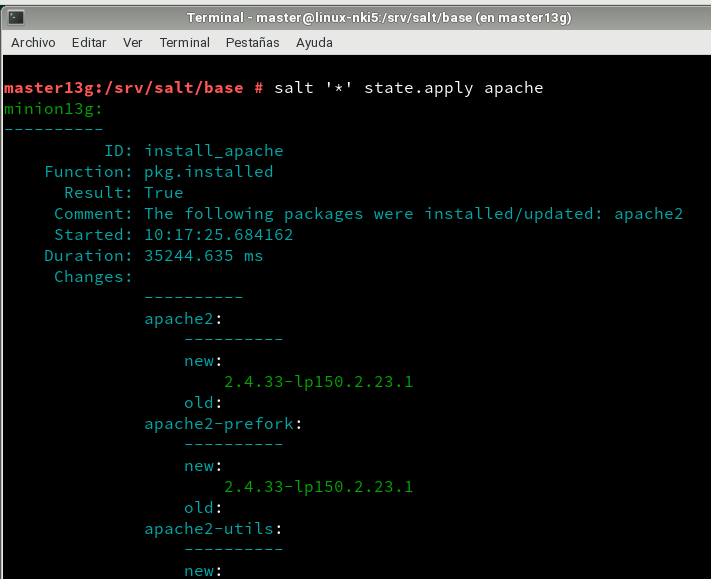
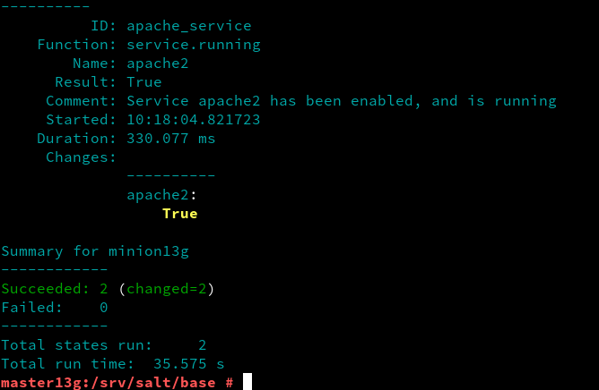

## 5 Crear más estados

### 5.1 Crear estados "users"
º Creamos un estado llamado ``users`` que nos servirá para crear un grupo y usuarios en las máquinas minions.

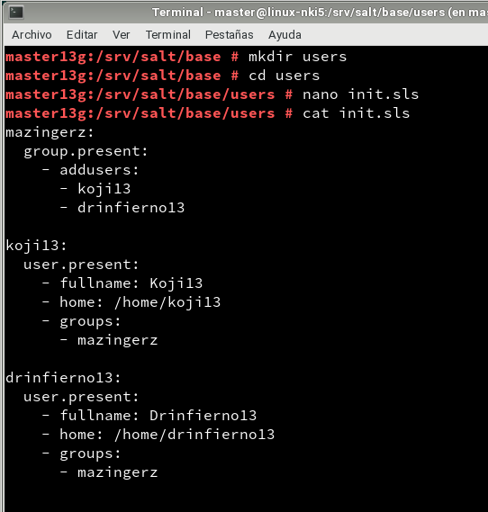

º Agregamos el estado en el fichero top.sls.

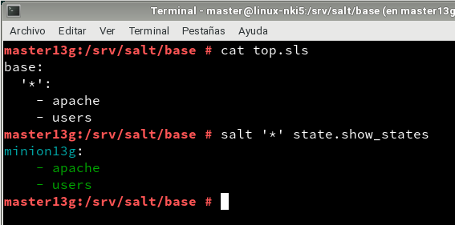

º Aplicamos el estado.

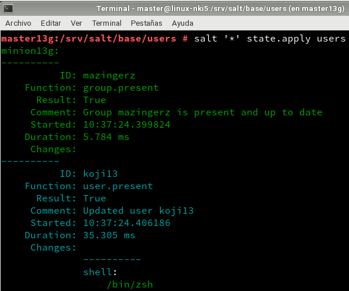
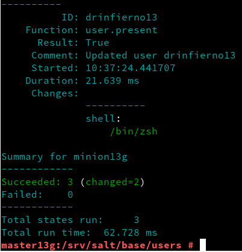

º Comprobamos que se crearon los usuarios.

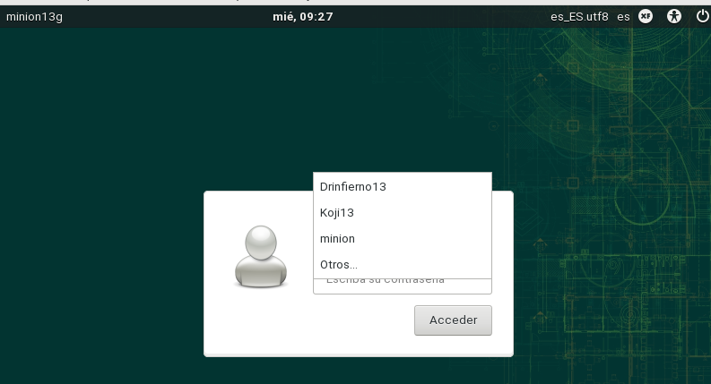

### 5.2 Crear estado "directories"
º Creamos un estado llamado ``drectories`` para crear las carpetas ``private`` (700), ``public`` (755) y ``group`` (750) con el usuario ``koji``.

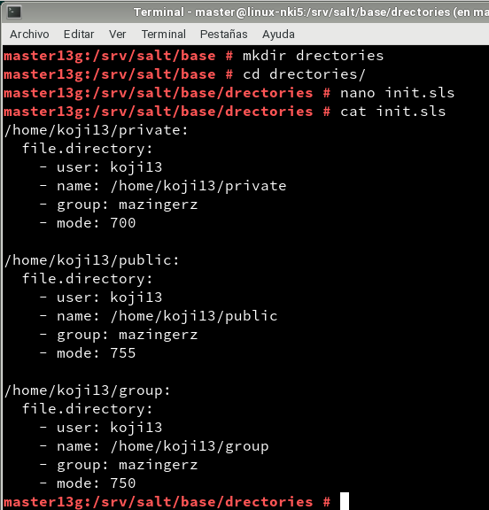

º Agregamos el estado en el fichero top.sls.

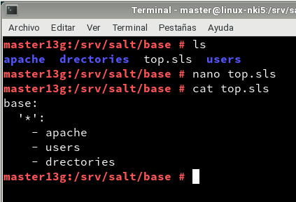

º Aplicamos el estado.

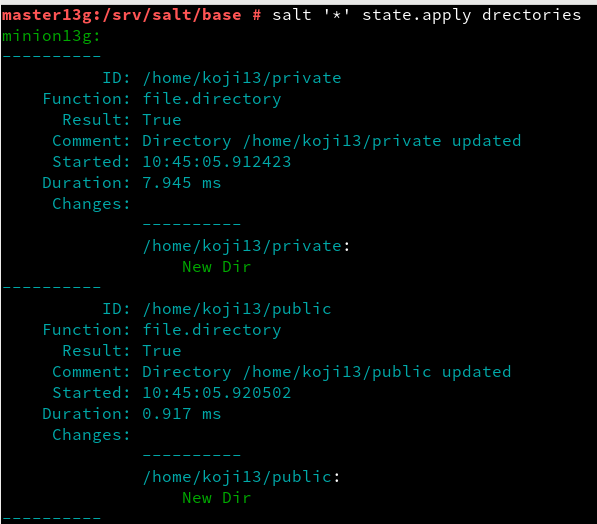
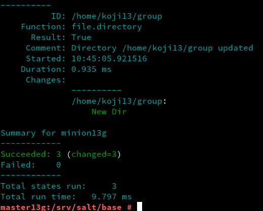

## 7. Añadir Minion de otro SO
º Creamos MV3 con SO Windows, con el nombre ``minionXXw``.

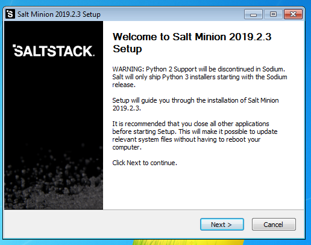

º Instalamos ``salt-minion`` y lo agregamos al máster.

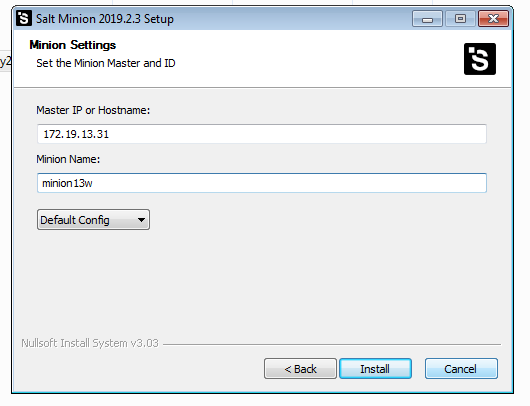
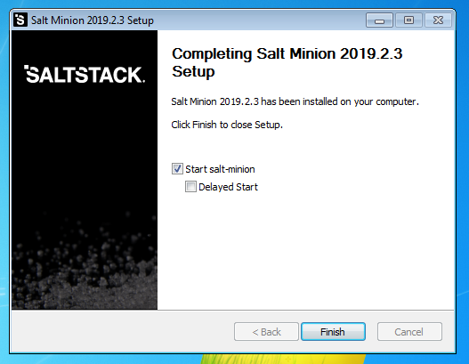

º Vamos al master y aceptamos la petición del minion de Windows.

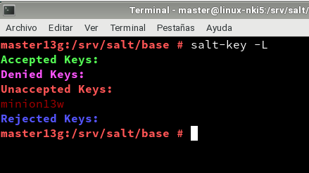

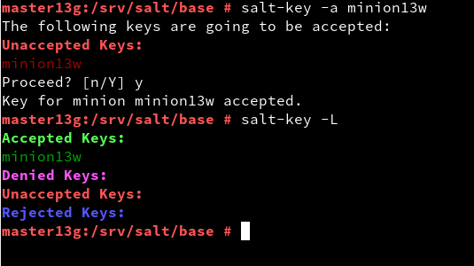
