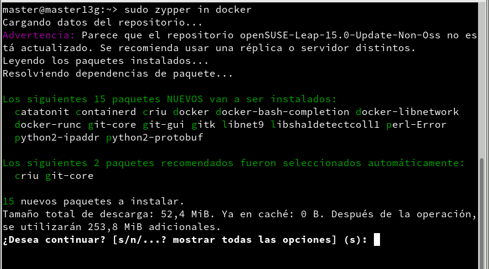

# Contenedores con Docker
Instalamos el docker.



Iniciamos el servicio del docker.


Incluimos a nuestro usuario en el grupo docker.


## 1 Habilitar el acceso a la red externa a los contenedores
Activamos la opción ```IP_FORWARD``` para poder tener acceso a la red exterior. Para ello tenemos que ponerle el valor 1.


### 1.1 Primera prueba
Para ver las imágenes descargadas podemos usar el comando: ```docker images```.
Para mostrar todos los contenedores creados, por ahora no debería de haber ninguno.


Para descargar una imagen, crear un contenedor y ejecutar la aplicación de la red usamos: ```docker run hello-world```.


Ahora vemos la nueva imagen ```hello-world``` descargada. Para ver los contenedores usamos: ```docker ps -a```.


## 2 Creación manual de nuestra imagen

### 2.1 Crear un contenedor manualmente
Buscamos en los repositorios de Docker Hub contenedores con la etiqueta debian.


Descargamos una imagen en local.


Comprobamos que se ha descargado.


Ahora vamos a crear un contenedor con nombre ```con_debian``` a partir de la imagen que hemos descargado.


### 2.2 Personalizar el contenedor
Para personalizar un poco el contenedor vamos a descargar un par de aplicaciones.


Instalamos nginx en el contenedor.


Instalamos el vi en el contenedor.


Creamos un fichero HTML.


Creamos un script.


Le damos permiso de ejecución al script.


### 2.3 Crear una imagen a partir del contenedor
A partir del contenedor vamos a crear la nueva imagen llamada javier/nginx1.


Comprobamos que se creó la imagen.


## 3 Crear contenedor a partir de nuestra imagen
### 3.1 Crear contenedor con Nginx
Creamos un contenedor con Nginx.


### 3.2 Comprobamos
Comprobamos que se creó el contenedor y esta activo.


Abrimos un navegador web y comprobamos el acceso al fichero html.


### 3.3 Migrar la imagen a otra máquina
Exportamos la imagen Docker a fichero .tar.


## 4. Dockerfile
### 4.1 Preparar ficheros
Creamos el directorio /home/nombre-alumno/dockerXXa. Ponemos una copia del fichero html y del script anterior en el nuevo directorio, además creamos un fichero llamado ```Dockerfile```.


### 4.2 Crear imagen a partir del Dockerfile
Construimos una nueva imagen a partir del Dockerfile.


Comprobamos que se construyó.


### 4.3 Crear contenedor y comprobar
A continuación vamos a crear un contenedor con el nombre con_nginx2, a partir de la imagen nombre-alumno/nginx2


Comprobamos en navegador.


### 4.4 Usar imágenes ya creadas
Creamos el directorio ```dockerXXb```. Creamos el fichero Dockerfile.


Creamos la imagen.


Creamos el contenedor.


## 5. Limpiar contenedores e imágenes.
Comprobamos todos los contenedores.


Paramos, borramos y comprobamos la eliminación del container, listamos las imágenes y eliminamos la imagen nombre-alumno/nginx3.


Comprobamos que se haya eliminado la imagen.


